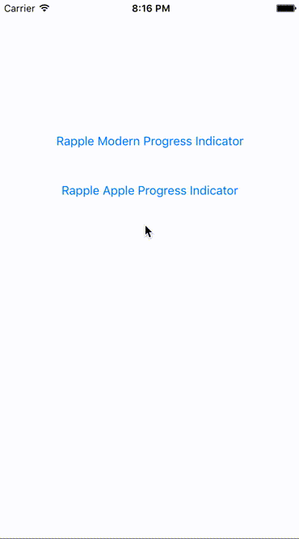

# RappleProgressHUD

[](https://travis-ci.org/Rajeev Prasad/RappleProgressHUD)
[](http://cocoapods.org/pods/RappleProgressHUD)
[](http://cocoapods.org/pods/RappleProgressHUD)
[](http://cocoapods.org/pods/RappleProgressHUD)

## Installation

RappleProgressHUD is available through [CocoaPods](http://cocoapods.org). To install it, simply add the following line to your Podfile:

## Usage

```ruby
pod "RappleProgressHUD" 
```

##Usage
import progress library

```ruby
import RappleProgressHUD
```
</BR>
Start Rapple progress indicator without any text message 
</BR>default attribute RappleModernAttributes
```ruby
RappleActivityIndicatorView.startAnimating()
```
</BR>
Start Rapple progress indicator with text message
</BR>param  - label text for progress text label
</BR>default attribute RappleModernAttributes
```ruby
RappleActivityIndicatorView.startAnimatingWithLabel("Loading...")
```
</BR>
Start Rapple progress indicator with attributes and without any text message
</BR>param  - attribute progress UI attributes
```ruby
RappleActivityIndicatorView.startAnimating(attributes: RappleModernAttributes)
```
</BR>
Start Rapple progress indicator with text message with attributes
</BR>param  - label text for progress text label
</BR>param  - attribute progress UI attributes
```ruby
RappleActivityIndicatorView.startAnimatingWithLabel("Loading...", attributes: RappleModernAttributes)
```
</BR>
Stop Rapple progress indicator
```ruby
RappleActivityIndicatorView.stopAnimating()
```

###Demo


## Example Project

To run the example project, clone the repo, and run `pod install` from the Example directory first.

## Author

Rajeev Prasad, rjeprasad@gmail.com

## License

Copyright (c) 2015 Rajeev Prasad <rjeprasad@gmail.com>

Permission is hereby granted, free of charge, to any person obtaining a copy
of this software and associated documentation files (the "Software"), to deal
in the Software without restriction, including without limitation the rights
to use, copy, modify, merge, publish, distribute, sublicense, and/or sell
copies of the Software, and to permit persons to whom the Software is
furnished to do so, subject to the following conditions:

The above copyright notice and this permission notice shall be included in
all copies or substantial portions of the Software.

THE SOFTWARE IS PROVIDED "AS IS", WITHOUT WARRANTY OF ANY KIND, EXPRESS OR
IMPLIED, INCLUDING BUT NOT LIMITED TO THE WARRANTIES OF MERCHANTABILITY,
FITNESS FOR A PARTICULAR PURPOSE AND NONINFRINGEMENT. IN NO EVENT SHALL THE
AUTHORS OR COPYRIGHT HOLDERS BE LIABLE FOR ANY CLAIM, DAMAGES OR OTHER
LIABILITY, WHETHER IN AN ACTION OF CONTRACT, TORT OR OTHERWISE, ARISING FROM,
OUT OF OR IN CONNECTION WITH THE SOFTWARE OR THE USE OR OTHER DEALINGS IN
THE SOFTWARE.

